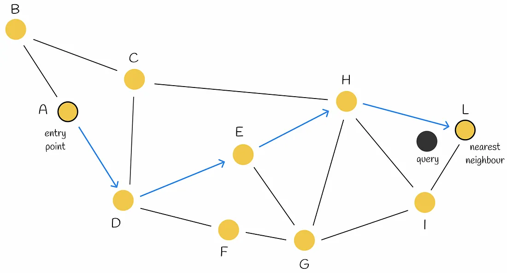
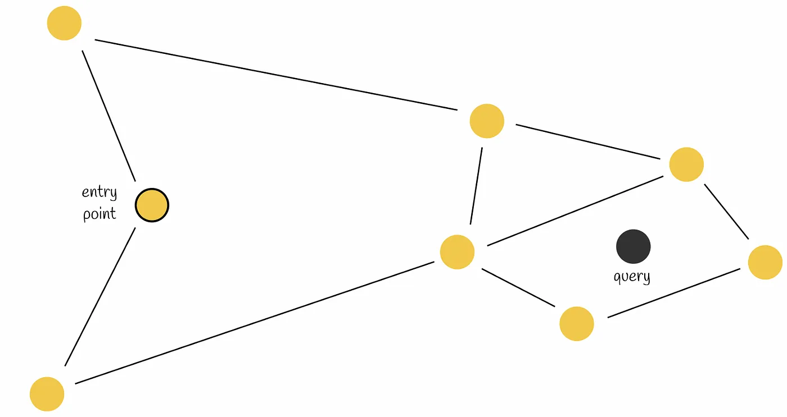
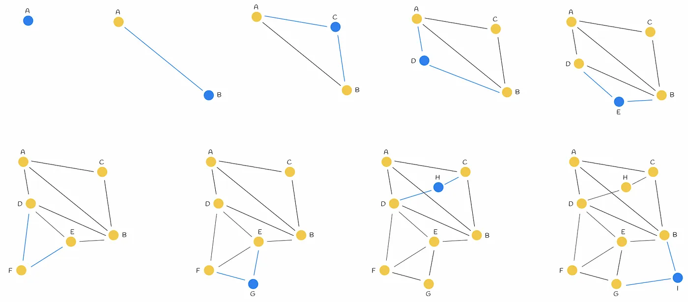

### Search

1. 节点A作为初始节点
   1. 邻居节点B
   2. 邻居节点D
   3. min(dist(query, B), dist(query, D)) = D
2. 移动至节点D
   1. 邻居节点A(已比较)
   2. 邻居节点C
   3. 邻居节点E
   4. 邻居节点F
   5. min(dist(query, C), dist(query, E), dist(query, F)) = E
3. 移动至节点E
   1. 邻居节点D(已比较)
   2. 邻居节点H
   3. 邻居节点G
   4. min(dist(query, H), dist(query, G)) = H
4. 移动至节点H
   1. 邻居节点C(已比较)
   2. 邻居节点H(已比较)
   3. 邻居节点G(已比较)
   4. 邻居节点I
   5. 邻居节点L
   6. min(dist(query, I), dist(query, L)) = L
5. 移动至节点L
   1. 邻居节点H(已比较)
   2. 邻居节点I(已比较)
6. 节点L作为查询结果

the first place, search is proceeded by choosing an entry point. To determine the next vertex (or vertices) to which the algorithm makes a move, it calculates the distances from the query vector to the current vertex’s neighbours and moves to the closest one. At some point, the algorithm terminates the search procedure when it cannot find a neighbour node that is closer to the query than the current node itself. This node is returned as the response to the query.

Early stopping. Both neighbours of the current node are further away from the query. Thus, the algorithm returns the current node as the response, though there exist much closer nodes to the query.

The search accuracy can be improved by using several entry points.

### Construction

The NSW graph is built by shuffling dataset points and inserting them one by one in the current graph. When a new node is inserted, it is then linked by edges to the M nearest vertices to it.

Sequential insertion of nodes (from left to right) with M = 2. At each iteration, a new vertex is added to the graph and linked to its M = 2 nearest neighbours. Blue lines represent the connected edges to a newly inserted node.
