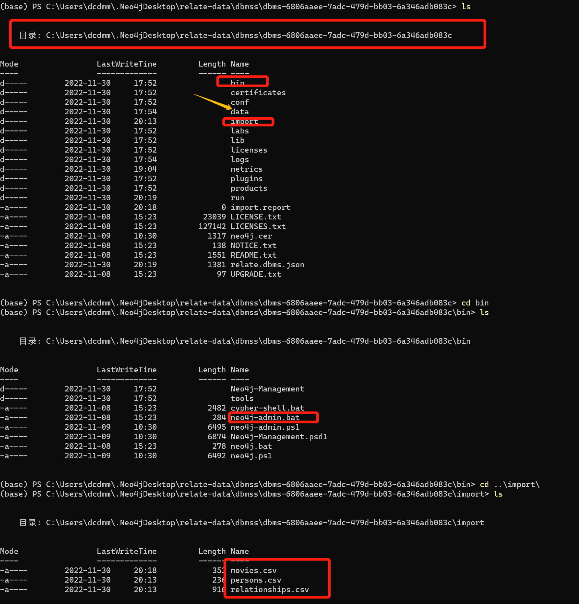

条件:

* 停止neo4j
* 只能生成新的数据库(若已经存在,则从data目录databases,transactions中删除该数据库),不能在已存在的数据库中插入数据

优点:

* 速度非常快
* 千万以上nodes

example:

```shell
# 导入到数据库neo4j(default)中
bin/neo4j-admin import --nodes=import/movies.csv --nodes=import/persons.csv --relationships=import/relationships.csv
```


* bin/neo4j-admin:
  * --nodes:节点csv文件(编码:UTF-8)
    * movies.csv:
      * :ID => 节点唯一ID,用于在创建关系时确定开始节点与结尾节点
      * :LABEL => 节点属性(节点可以拥有多个属性)
  * --relationships:关系csv文件(编码:UTF-8)
    * relationships.csv: 
      * :START_ID => 开始节点ID
      * :END_ID => 结尾节点ID
      * :TYPE => 关系属性